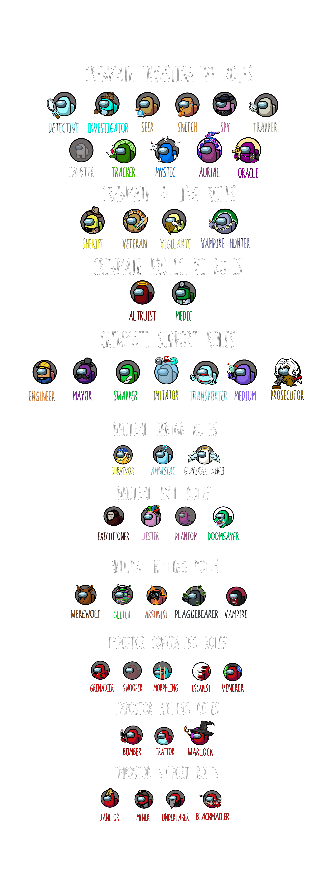
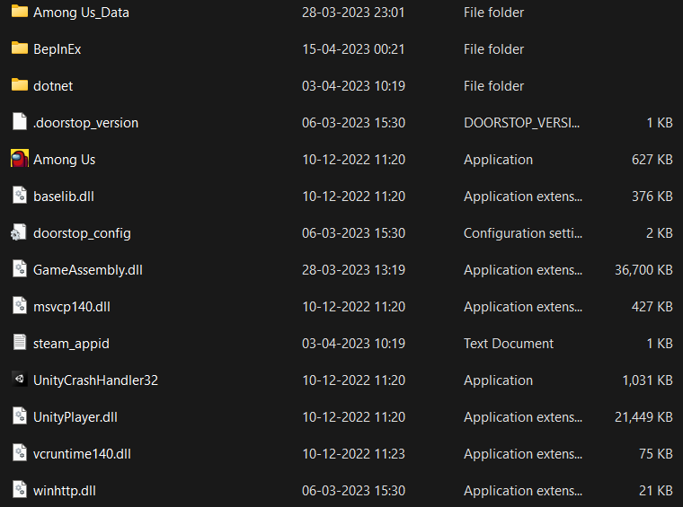
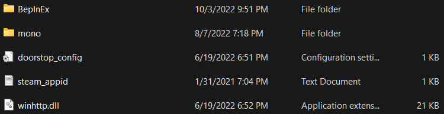

## *Note: This repository is an unofficial continuation of Town of Us due to the original repository being discontinued.*

An [Among Us](https://store.steampowered.com/app/945360/Among_Us) mod that adds a bunch of roles, modifiers and game settings.

Join our [Discord](https://discord.gg/ugyc4EVUYZ) if you have any problems or want to find people to play with!

# ***Contents***

[**Contents**](#contents)

[**Releases**](#releases)

[**Changelogs**](#changelogs)

[**Installation**](#installation)
- [Requirements](#requirements)
- [Steam Guide](#steam-guide)
- [Epic Games Guide](#epic-games-guide)
- [Issues](#issues)

[**Uninstallation**](#uninstallation)

[**Roles & Modifiers**](#roles--modifiers)

| [Impostors](#impostor-roles)    | [Crewmates](#crewmate-roles)      | [Neutrals](#neutral-roles)        | [Modifiers](#modifiers)       |
|---------------------------------|-----------------------------------|-----------------------------------|-------------------------------|
| [Assassin](#assassin)           | [Altruist](#altruist)             | [Amnesiac](#amnesiac)             | [Bait](#bait)                 |
| [Blackmailer](#blackmailer)     | [Chameleon](#chameleon)           | [Arsonist](#arsonist)             | [Blind](#blind)               |
| [Bomber](#bomber)               | [Crewmate](#crewmate)             | [Executioner](#executioner)       | [Button Barry](#button-barry) |
| [Clairvoyant](#clairvoyant)     | [Cultist Mystic](#cultist-mystic) | [Glitch](#glitch)                 | [Diseased](#diseased)         |
| [Consigliere](#consigliere)     | [Cultist Seer](#cultist-seer)     | [Guardian Angel](#guardian-angel) | [Disperser](#disperser)       |
| [Demolitionist](#demolitionist) | [Detective](#detective)           | [Jester](#jester)                 | [Double Shot](#double-shot)   |
| [Escapist](#escapist)           | [Engineer](#engineer)             | [Juggernaut](#juggernaut)         | [Flash](#flash)               |
| [Grenadier](#grenadier)         | [Haunter](#haunter)               | [Pestilence](#pestilence)         | [Giant](#giant)               |
| [Impostor](#impostor)           | [Imimtator](#imitator)            | [Phantom](#phantom)               | [Lovers](#lovers)             |
| [Janitor](#janitor)             | [Investigator](#investigator)     | [Plaguebearer](#plaguebearer)     | [Multitasker](#multitasker)   |
| [Miner](#miner)                 | [Mayor](#mayor)                   | [Survivor](#survivor)             | [Radar](#radar)               |
| [Morphling](#morphling)         | [Medic](#medic)                   | [Werewolf](#werewolf)             | [Sleuth](#sleuth)             |
| [Necromancer](#necromancer)     | [Medium](#medium)                 |                                   | [Tiebreaker](#tiebreaker)     |
| [Rogue Agent](#rogue-agent)     | [Mystic](#mystic)                 |                                   | [Torch](#torch)               |
| [Swooper](#swooper)             | [Seer](#seer)                     |                                   | [Underdog](#underdog)         |
| [Traitor](#traitor)             | [Sheriff](#sheriff)               |                                   |                               |
| [Undertaker](#undertaker)       | [Snitch](#snitch)                 |                                   |                               |
| [Whisperer](#whisperer)         | [Spy](#spy)                       |                                   |                               |
|                                 | [Swapper](#swapper)               |                                   |                               |
|                                 | [Tracker](#tracker)               |                                   |                               |
|                                 | [Transporter](#transporter)       |                                   |                               |
|                                 | [Trapper](#trapper)               |                                   |                               |
|                                 | [Veteran](#veteran)               |                                   |                               |
|                                 | [Vigilante](#vigilante)           |                                   |                               |

-----------------------

# Releases
| Among Us - Version| Mod Version | Link |
|----------|-------------|-----------------|
| 2023.3.28s & 2023.3.28e | v4.0.5 | [Download](https://github.com/eDonnes124/Town-Of-Us/releases/download/v4.0.5/ToU.v4.0.5.zip) |
| 2023.3.28s & 2023.3.28e | v4.0.4 | [Download](https://github.com/eDonnes124/Town-Of-Us/releases/download/v4.0.4/ToU.v4.0.4.zip) |
| 2023.2.28s & 2023.2.28e | v4.0.3 | [Download](https://github.com/eDonnes124/Town-Of-Us/releases/download/v4.0.3/ToU.v4.0.3.zip) |
| 2022.12.14s & 2022.12.14e | v4.0.2 | [Download](https://github.com/eDonnes124/Town-Of-Us/releases/download/v4.0.2/ToU.v4.0.2.zip) |
| 2022.12.14s & 2022.12.14e | v4.0.1 | [Download](https://github.com/eDonnes124/Town-Of-Us/releases/download/v4.0.1/ToU.v4.0.1.zip) |
| 2022.12.14s & 2022.12.14e | v4.0.0 | [Download](https://github.com/eDonnes124/Town-Of-Us/releases/download/v4.0.0/ToU.v4.0.0.zip) |
| 2022.10.25s & 2022.10.25e | v3.4.0 | [Download](https://github.com/eDonnes124/Town-Of-Us/releases/download/v3.4.0/ToU.v3.4.0.zip) |
| 2022.8.24s & 2022.8.24e & 2022.9.20s & 2022.9.20e | v3.3.2 | [Download](https://github.com/eDonnes124/Town-Of-Us/releases/download/v3.3.2/ToU.v3.3.2.zip) |
| 2022.8.24s & 2022.8.24e & 2022.9.20s & 2022.9.20e | v3.3.1 | [Download](https://github.com/eDonnes124/Town-Of-Us/releases/download/v3.3.1/ToU.v3.3.1.zip) |
| 2022.8.24s & 2022.8.24e & 2022.9.20s & 2022.9.20e | v3.3.0 | [Download](https://github.com/eDonnes124/Town-Of-Us/releases/download/v3.3.0/ToU.v3.3.0.zip) |
| 2022.6.21s & 2022.6.21e & 2022.7.12s & 2022.7.12e | v3.2.0 | [Download](https://github.com/eDonnes124/Town-Of-Us/releases/download/v3.2.0/ToU.v3.2.0.zip) |
| 2022.3.29s & 2022.3.29e & 2022.4.19e | v3.1.0 | [Download](https://github.com/eDonnes124/Town-Of-Us/releases/download/v3.1.0/ToU.v3.1.0.zip) |
| 2022.3.29s & 2022.3.29e & 2022.4.19e | v3.0.1 | [Download](https://github.com/eDonnes124/Town-Of-Us/releases/download/v3.0.1/ToU.v3.0.1.zip) |
| 2022.3.29s & 2022.3.29e & 2022.4.19e | v3.0.0 | [Download](https://github.com/eDonnes124/Town-Of-Us/releases/download/v3.0.0/ToU.v3.0.0.zip) |
| 2021.12.15s & 2021.12.15e Until 2022.2.24s & 2022.2.24e | v2.6.5 | [Download](https://github.com/eDonnes124/Town-Of-Us/releases/download/v2.6.5/ToU.v2.6.5.zip) |
| 2021.12.15s & 2021.12.15e Until 2022.2.24s & 2022.2.24e | v2.6.4 | [Download](https://github.com/eDonnes124/Town-Of-Us/releases/download/v2.6.4/ToU.v2.6.4.zip) |
| 2021.6.30s & 2021.6.30e & 2021.7.20e | v2.6.4 | [Download](https://github.com/eDonnes124/Town-Of-Us/releases/download/v2.6.4/ToU.v2.6.4-2021.6.30.zip) |
| 2021.12.15s & 2021.12.15e Until 2022.2.24s & 2022.2.24e | v2.6.3 | [Download](https://github.com/eDonnes124/Town-Of-Us/releases/download/v2.6.3/ToU.v2.6.3.zip) |
| 2021.6.30s & 2021.6.30e & 2021.7.20e | v2.6.3 | [Download](https://github.com/eDonnes124/Town-Of-Us/releases/download/v2.6.3/ToU.v2.6.3-2021.6.30.zip) |
| 2021.12.15s & 2021.12.15e Until 2022.2.24s & 2022.2.24e | v2.6.2 | [Download](https://github.com/eDonnes124/Town-Of-Us/releases/download/v2.6.2/ToU.v2.6.2.zip) |
| 2021.6.30s & 2021.6.30e & 2021.7.20e | v2.6.2 | [Download](https://github.com/eDonnes124/Town-Of-Us/releases/download/v2.6.2/ToU.v2.6.2-2021.6.30.zip) |
| 2021.12.15s & 2021.12.15e Until 2022.2.24s & 2022.2.24e | v2.6.1 | [Download](https://github.com/eDonnes124/Town-Of-Us/releases/download/v2.6.1/ToU.v2.6.1.zip) |
| 2021.6.30s & 2021.6.30e & 2021.7.20e | v2.6.1 | [Download](https://github.com/eDonnes124/Town-Of-Us/releases/download/v2.6.1/ToU.v2.6.1.Old.zip) |
| 2021.12.15s & 2021.12.15e Until 2022.2.24s & 2022.2.24e | v2.6.0 | [Download](https://github.com/eDonnes124/Town-Of-Us/releases/download/v2.6.0/ToU.v2.6.0.zip) |
| 2021.6.30s & 2021.6.30e & 2021.7.20e | v2.6.0 | [Download](https://github.com/eDonnes124/Town-Of-Us/releases/download/v2.6.0/ToU.v2.6.0.Old.zip) |
| 2021.12.15s & 2021.12.15e Until 2022.2.24s & 2022.2.24e | v2.5.1 | [Download](https://github.com/eDonnes124/Town-Of-Us/releases/download/v2.5.1/ToU.v2.5.1.zip) |
| 2021.12.15s & 2021.12.15e Until 2022.2.24s & 2022.2.24e | v2.5.0 | [Download](https://github.com/eDonnes124/Town-Of-Us/releases/download/v2.5.0/ToU.v2.5.0.zip) |
| 2021.6.30s & 2021.6.30e & 2021.7.20e | v2.5.0 | [Download](https://github.com/eDonnes124/Town-Of-Us/releases/download/v2.5.0/ToU.v2.5.0.Old.zip) |
| 2021.12.15s & 2021.12.15e Until 2022.2.24s & 2022.2.24e | v2.4.2 | [Download](https://github.com/eDonnes124/Town-Of-Us/releases/download/v2.4.2/ToU.v2.4.2.zip) |
| 2021.12.15s & 2021.12.15e Until 2022.2.24s & 2022.2.24e | v2.4.1 | [Download](https://github.com/eDonnes124/Town-Of-Us/releases/download/v2.4.1/ToU.v2.4.1.zip) |
| 2021.11.9.5s & 2021.11.9.5e | v2.4.0 | [Download](https://github.com/eDonnes124/Town-Of-Us/releases/download/v2.4.0/ToU.v2.4.0.zip) |
| 2021.6.30s & 2021.6.30e & 2021.7.20e | v2.3.4 | [Download](https://github.com/eDonnes124/Town-Of-Us/releases/download/v2.3.4/ToU.v2.3.4.zip) |
| 2021.6.30s & 2021.6.30e & 2021.7.20e | v2.3.3 | [Download](https://github.com/eDonnes124/Town-Of-Us/releases/download/v2.3.3/ToU.v2.3.3.zip) |
| 2021.6.30s & 2021.6.30e & 2021.7.20e | v2.3.2 | [Download](https://github.com/eDonnes124/Town-Of-Us/releases/download/v2.3.2/ToU.v2.3.2.zip) |
| 2021.6.30s & 2021.6.30e & 2021.7.20e | v2.3.1 | [Download](https://github.com/eDonnes124/Town-Of-Us/releases/download/v2.3.1/ToU.v2.3.1.zip) |
| 2021.6.30s & 2021.6.30e & 2021.7.20e | v2.3.0 | [Download](https://github.com/eDonnes124/Town-Of-Us/releases/download/v2.3.0/ToU.v2.3.0.zip) |
| 2021.6.30s & 2021.6.30e & 2021.7.20e | v2.2.1 | [Download](https://github.com/polusgg/Town-Of-Us/releases/download/v2.2.1/TOU_221.zip) |
| 2021.6.30s & 2021.6.30e & 2021.7.20e | v2.2.0 | [Download](https://github.com/polusgg/Town-Of-Us/releases/download/v2.2.0/TOU_220.zip) |
| 2021.6.15s & 2021.6.15e | v2.1.4 | [Download](https://github.com/polusgg/Town-Of-Us/releases/download/v2.1.4/TOU_214.zip) |
| 2021.6.15s & 2021.6.15e | v2.1.3 | [Download](https://github.com/polusgg/Town-Of-Us/releases/download/v2.1.3/TownOfUs213_1.zip) |
| 2021.6.15s & 2021.6.15e | v2.1.2 | [Download](https://github.com/polusgg/Town-Of-Us/releases/download/v2.1.2/TownOfUs212_1.zip) |
| 2021.6.15s & 2021.6.15e | v2.1.1 | [Download](https://github.com/polusgg/Town-Of-Us/releases/download/v2.1.1/TownOfUs211_1.zip) |
| 2021.5.10s | v2.0.4 | [Download](https://github.com/polusgg/Town-Of-Us/releases/download/v2.0.4/TownOfUs-v2.0.4.zip) |
| 2021.5.10s | v2.0.3 | [Download](https://github.com/polusgg/Town-Of-Us/releases/download/v2.0.3/TownOfUs-v2.0.3.zip) |
| 2021.4.12s & 2021.4.14s | v2.0.2 | [Download](https://github.com/polusgg/Town-Of-Us/releases/download/v2.0.2/TownOfUs-v2.0.2.zip) |
| 2021.4.12s | v2.0.1 | [Download](https://github.com/polusgg/Town-Of-Us/releases/download/v2.0.1/TownOfUs-v2.0.1.zip) |
| 2021.3.31.3s | v2.0.0 | [Download](https://github.com/polusgg/Town-Of-Us/releases/download/v2.0.0/TownOfUs-v2.0.0.zip) |
| 2021.3.5s | v1.2.0 | [Download](https://github.com/polusgg/Town-Of-Us/releases/download/v1.2.0/TownOfUs-v1.2.0.zip) |
| 2021.3.5s | v1.1.0 | [Download](https://github.com/polusgg/Town-Of-Us/releases/download/v1.1.0/TownOfUs-v1.1.0-2021.3.5s.zip) |
| 2020.12.19s | v1.1.0 | [Download](https://github.com/polusgg/Town-Of-Us/releases/download/v1.1.0/TownOfUs-v1.1.0-2020.12.9s.zip) |
| 2020.12.19s | v1.0.3 | [Download](https://github.com/polusgg/Town-Of-Us/releases/download/v1.0.3/TownOfUs-v1.0.3.zip) |
| 2020.12.19s | v1.0.2 | [Download](https://github.com/polusgg/Town-Of-Us/releases/download/v1.0.2/TownOfUs-v1.0.2.zip) |
| 2020.12.19s | v1.0.1 | [Download](https://github.com/polusgg/Town-Of-Us/releases/download/v1.0.1/TownOfUs-v1.0.1.zip) |
| 2020.12.19s | v1.0.0 | [Download](https://github.com/polusgg/Town-Of-Us/releases/download/v1.0.0/TownOfUs-v1.0.0.zip) |

  
 Changelog 

  

  
 v4.0.5 

      <ul> <li>Bug Fix: Exile Functions now work when someone disconnects right after being assassinated</li> </ul>
  

  

  
 v4.0.4 

    <ul> <li>Compatibility with the new Among Us version v2023.3.28</li> </ul>
    <ul> <li>Haunter/Phantom/Traitor spawn adjustments</li> </ul>
  

  

  
 v4.0.3 

    <ul> <li>Compatibility with the new Among Us version v2023.2.28</li> </ul>
    <ul> <li>New Setting: Who can see dead players on admin (under Spy)</li> </ul>
    <ul> <li>Bug Fix: Transporter and Glitch get everyone alive on their transport/mimic menus</li> </ul>
    <ul> <li>Bug Fix: Undertaker can no longer drag bodies to unreportable positions</li> </ul>
    <ul> <li>Bug Fix: Players can no longer infinitely vent in Hide & Seek</li> </ul>
    <ul> <li>Bug Fix: Swapper swap bugs... all of them... I think</li> </ul>
    <ul> <li>Optimisation: As Imitator you no longer need to deselect someone to select another player</li> </ul>
    <ul> <li>Medic Shields and Guardian Angel Protects now stop a Bomb detonation and Arsonist ignites</li> </ul>
  

  

  
 v4.0.2 

    <ul> <li>Bug Fix: Cultist no longer doesn't automatically set the Impostors to 1 for the game mode</li> </ul>
    <ul> <li>Bug Fix: Dead people no longer interfere with how many people die to a bomb</li> </ul>
    <ul> <li>Added a new Examine Report to Detective</li> </ul>
    <ul> <li>Engineer Fix Per Round/Game changed to Uses throughout the game</li> </ul>
    <ul> <li>Made Medic & Trapper imitatable for the Imitator</li> </ul>
    <ul> <li>Added indications so the dead can see who the Guardian Angel and Executioner targets are</li> </ul>
    <ul> <li>Removed option for Snitch to be hidden on Game Start</li> </ul>
  

  

  
 v4.0.1 

    <ul> <li>Fixed the Kill Button not working in Hide & Seek</li> </ul>
  

  

  
 v4.0.0 

    <ul> <li>Compatibility with the new Among Us version v2022.12.14</li> </ul>
    <ul> <li>New Role: Imitator (Replacing Time Lord)</li> </ul>
    <ul> <li>New Role: Bomber (Poisoner rework)</li> </ul>
    <ul> <li>New Game Mode: Cultist</li> </ul>
    <ul> <li>New Game Mode Roles: Necromancer & Whisperer as well as Crewmate/Impostor variants of already existing roles</li> </ul>
    <ul> <li>New Setting: Enable Hidden Roles</li> </ul>
    <ul> <li>New Settings for hidden roles</li> </ul>
    <ul> <li>New Setting: Undertaker Drag Speed</li> </ul>
    <ul> <li>Bug Fix: Executioner/Guardian Angel turned Amnesiac/Jester/Survivor no longer have red text after changing role</li> </ul>
    <ul> <li>Amnesiac remembering a role no longer makes their task list swap with the player they remembered</li> </ul>
    <ul> <li>Bug Fix: Amnesiac no longer sees themself with the remembered players' modifier</li> </ul>
    <ul> <li>Bug Fix: Amnesiac no longer loses tasks if the person they remembered from disconnects or vice versa</li> </ul>
    <ul> <li>Bug Fix: Underdog kill timer is now in sync with normal kill cooldowns</li> </ul>
    <ul> <li>Bug Fix: Underdog now has the correct kill cooldown on game start</li> </ul>
    <ul> <li>Bug Fix: Underdog now can have a kill cooldown below 10secs</li> </ul>
    <ul> <li>Bug Fix: Miner's mines are no longer invisible in certain places</li> </ul>
    <ul> <li>Bug Fix: Undertaker no longer can make a body become invisible in certain places</li> </ul>
    <ul> <li>Bug Fix: Neutral Killers now get correct cooldowns when attacking a vesting Survivor or a Guardian Angel shield</li> </ul>
    <ul> <li>Adjusted the Trapper's trap & Grenadier's flash radius so they scale correctly</li> </ul>
  

  

  
 v3.4.0 

    <ul> <li>New Role: Escapist</li> </ul>
    <ul> <li>New Modifier: Radar</li> </ul>
    <ul> <li>New Modifier: Disperser</li> </ul>
    <ul> <li>New Modifier: Multitasker</li> </ul>
    <ul> <li>New Modifier: Double Shot</li> </ul>
    <ul> <li>New Settings: Arsonist/Jester has Impostor Vision</li> </ul>
    <ul> <li>New Setting: Arsonist Ignite Cooldown removed when they're the final killer</li> </ul>
    <ul> <li>Reporting bodies now spreads the Plaguebearer's infection</li> </ul>
    <ul> <li>Changed Underdog from a role to a modifier</li> </ul>
    <ul> <li>Changed Blind to a Crewmate Modifier</li> </ul>
  

  

  
 v3.3.2 

    <ul> <li>New Setting: Snitch doesn't see Traitor</li> </ul>
    <ul> <li>New Settings: Neutral Killing Roles can assassinate</li> </ul>
    <ul> <li>Bug Fix: People no longer show as Phantom/Haunter when they're not</li> </ul>
  

  

  
 v3.3.1 

    <ul> <li>Bug Fix: The game no longer occasionally freezes after a meeting</li> </ul>
  

  

  
 v3.3.0 

    <ul> <li>New Game Mode: All Any</li> </ul>
    <ul> <li>New Game Mode: Killers Only</li> </ul>
    <ul> <li>New Settings for Random Maps</li> </ul>
    <ul> <li>New Settings for Automatically adjusting settings depending on the map</li> </ul>
    <ul> <li>New Settings for Better Polus (and some adjustments were added as well)</li> </ul>
    <ul> <li>Split Settings Menu into 5 different menus (however settings are still loaded from the main one)</li> </ul>
    <ul> <li>Added 2 more Settings slots (bringing the total to 5)</li> </ul>
    <ul> <li>Bug Fix: Sheriff can no longer get the report button through walls</li> </ul>
    <ul> <li>Bug Fix: Starting Impostor Kill Cooldown is now always set to the right amount</li> </ul>
    <ul> <li>Bug Fix: Amnesiac remembering Traitor no longer makes another Traitor spawn</li> </ul>
    <ul> <li>Bug Fix: Underdog now gets the correct cooldown when there is more then 1 Impostor</li> </ul>
    <ul> <li>Bug Fix: An Impostor killing a Diseased player will now get the correct cooldown</li> </ul>
    <ul> <li>Bug Fix: The only person who will know they have a GA is the GA target (if target knows they have a GA)</li> </ul>
    <ul> <li>Bug Fix: Revived players from Poisoner kills no longer instantly die at the start of the next meeting</li> </ul>
  

  

  
 v3.2.0 

    <ul> <li>Compatability with the new Among Us version thanks to MyDragonBreath</li> </ul>
    <ul> <li>New Role: Plaguebearer/Pestilence</li> </ul>
    <ul> <li>New Role: Werewolf</li> </ul>
    <ul> <li>New Role: Trapper</li> </ul>
    <ul> <li>New Role: Detective</li> </ul>
    <ul> <li>New Modifier: Blind (replacing Drunk)</li> </ul>
    <ul> <li>Arsonist Rework: Douse and Ignite are on the same cooldown, however to ignite they must be standing next to one of their douses</li> </ul>
    <ul> <li>New Settings: Vigilante/Assassin can guess lovers</li> </ul>
    <ul> <li>New Setting: Traitor does not swap colours for Seer</li> </ul>
    <ul> <li>New Settings: Sheriff can shoot Werewolf/Plaguebearer</li> </ul>
    <ul> <li>New Settings: Min and Max Neutral Killing/Non-Killing Roles</li> </ul>
    <ul> <li>Setting Change: Traitor does not spawn if Glitch is alive to Traitor does not spawn if Neutral Killing is alive</li> </ul>
    <ul> <li>Survivor can now win with neutral killing roles and can get a Survivor only win</li> </ul>
    <ul> <li>Tasks can now be set above the maximum default values</li> </ul>
    <ul> <li>Transporter can now die to a Veteran on alert if they transport the Veteran</li> </ul>
    <ul> <li>Bug Fix: Impostors on high ping can no longer kill multiple players</li> </ul>
    <ul> <li>Bug Fix: Poisoned players now die before a meeting and not during a meeting</li> </ul>
    <ul> <li>Bug Fix: Glitch and Poisoner can no longer kill/poison in vents</li> </ul>
    <ul> <li>Bug Fix: Underdog now gets the correct cooldown when killing a diseased player</li> </ul>
    <ul> <li>Bug Fix: Phantom/Haunter now appear in the correct places</li> </ul>
    <ul> <li>Bug Fix: The Blackmailer now sees the correct colour name of their teammates depending on if they are blackmailed or not</li> </ul>
    <ul> <li>Bug Fix: Lag is no longer caused when attempting to repick the Traitor</li> </ul>
  

  

  
 v3.1.0 

    <ul> <li>Submerged Compatibility mostly thanks to MyDragonBreath</li> </ul>
    <ul> <li>New Setting: Assassins can guess Crewmate Modifiers</li> </ul>
    <ul> <li>New Setting: Assassins and Vigilante can guess after voting</li> </ul>
    <ul> <li>New Settings: Guardian Angel knows their target's role and Guardian Angel's target knows they have a Guardian Angel</li> </ul>
    <ul> <li>New Settings: Bait minimum and maximum delay</li> </ul>
    <ul> <li>New Setting: Diseased Kill Multiplier</li> </ul>
    <ul> <li>New Setting: Flash Speed</li> </ul>
    <ul> <li>New Setting: Giant Speed</li> </ul>
    <ul> <li>New Setting: Disable meeting skip button</li> </ul>
    <ul> <li>Bug Fix: Kill buttons should have the correct text and sprite now</li> </ul>
    <ul> <li>Bug Fix: Glitch kills no longer bypass Survivor Vests and GA Protects</li> </ul>
    <ul> <li>Lighter and Darker indicators for Medic</li> </ul>
  

  

  
 v3.0.1 

    <ul> <li>Bug Fix: All the flashes on screen now work again</li> </ul>
    <ul> <li>Bug Fix: Amnesiac turned Sheriff/Glitch/Impostor now has a kill button again</li> </ul>
    <ul> <li>Bug Fix: The kill button now has the word 'Kill' on it again</li> </ul>
    <ul> <li>Bug Fix: The Blackmailer's blackmail button will now not always show active even when not near someone</li> </ul>
    <ul> <li>Blackmailer now only has an initial cooldown, meaning the cooldown doesn't reset after a use now</li> </ul>
  

  

  
 v3.0.0 

    <ul> <li>New Role: Medium</li> </ul>
    <ul> <li>New Role: Survivor</li> </ul>
    <ul> <li>New Role: Guardian Angel</li> </ul>
    <ul> <li>New Role: Blackmailer</li> </ul>
    <ul> <li>New Role: Mystic</li> </ul>
    <ul> <li>Camouflager removed</li> </ul>
    <ul> <li>New Settings for Vigilante to kill each type of Neutral role</li> </ul>
    <ul> <li>New Settings for Assassins to kill each type of Neutral role</li> </ul>
    <ul> <li>Bug Fix: Executioner will always get a target unless there is no feasible target</li> </ul>
    <ul> <li>Bug Fix: Executioner will always win when their target is voted out</li> </ul>
    <ul> <li>The future Phantom, Haunter and Traitor will change depending on the current circumstances</li> </ul>
    <ul> <li>Bug Fix: Abilities can no longer be used while loading into a game</li> </ul>
    <ul> <li>Added an option to cycle backwards for Assassins and Vigilante</li> </ul>
  

  

  
 v2.6.5 

    <ul> <li>Fixed Amnesiac remembering Poisoner interaction</li> </ul>
    <ul> <li>Fixed Button Barry not working during sabotages</li> </ul>
    <ul> <li>Fixed Poisoner interactions against Medic shields and Veteran alerts</li> </ul>
    <ul> <li>Transporting now works a little differently</li> </ul>
    <ul> <li>If a player is transported when they are in a position out of bounds while on something like a ladder, it rejects the transport</li> </ul>
    <ul> <li>Glitch and Transporter can now be lovers</li> </ul>
  

  

  
 v2.6.4 

    <ul> <li>Fixed Transporter bugging out after transporting a dead body</li> </ul>
    <ul> <li>Reduced Tracker arrow lag</li> </ul>
    <ul> <li>Fixed bug with Swapper where you wouldn't appear as dead after being assassinated with your swap targets already selected</li> </ul>
    <ul> <li>Fixed Medic shield not protecting the target from impostors if the Shield Breaks option is off</li> </ul>
    <ul> <li>Fixed Medic reports saying the wrong color if the body's killer was morphed</li> </ul>
    <ul> <li>Fixed Investigator showing a morphed player's footprints as the color of the player they were morphed into</li> </ul>
    <ul> <li>Ghosts no longer briefly appear after a player dies</li> </ul>
  

  

  
 v2.6.3 

    <ul> <li>Fixed the bug where games don't end (Sorry about that)</li> </ul>
    <ul> <li>Fixed Bait not causing a self-report sometimes</li> </ul>
    <ul> <li>Fixed Amnesiac turned Impostor not being able to kill</li> </ul>
    <ul> <li>Fixed Traitor not being able to kill</li> </ul>
    <ul> <li>Fixed Impostors not being able to kill a player revived by an Altruist</li> </ul>
    <ul> <li>Fixed Flash and Giant not appearing to move at the correct speed for other players</li> </ul>
    <ul> <li>Changed Giant and Flash colors</li> </ul>
    <ul> <li>Split Classic Nameplates setting into Disable Level Icon and Disable Background Cosmetics</li> </ul>
  

  

  
 v2.6.2 

    <ul> <li>Fixed End Game Tracker Bug</li> </ul>
    <ul> <li>Fixed Snitch Arrows</li> </ul>
    <ul> <li>Added Olive Colour</li> </ul>
    <ul> <li>Dead bodies are now removed after meetings</li> </ul>
    <ul> <li>Added an option for Amnesiac Arrows</li> </ul>
    <ul> <li>Fixed the issue where if a player is transported as they jump in a vent they are freezed in place</li> </ul>
  

  

  
 v2.6.1 

    <ul> <li>Fixed Poisoner killing Bait after another report resulting in a duplicated meeting</li> </ul>
    <ul> <li>Fixed the issue where the Snitch spawning as Crewmate would see their name gold</li> </ul>
    <ul> <li>Fixed Amnesiac remembering Transporter becoming an Impostor</li> </ul>
    <ul> <li>Fixed Tracker Arrows</li> </ul>
  

  

  
 v2.6.0 

    <ul> <li>Fixed killing the Bait instantly banning everyone</li> </ul>
    <ul> <li>Fixed Tracker lag</li> </ul>
    <ul> <li>Seer adjustments</li> </ul>
    <ul> <li>Settings for task tracking</li> </ul>
    <ul> <li>Added a flash radius setting for Grenadier</li> </ul>
    <ul> <li>New Role: Traitor</li> </ul>
    <ul> <li>New Role: Transporter</li> </ul>
    <ul> <li>New Modifier: Sleuth</li> </ul>
    <ul> <li>Fixed Snitch/Haunter meetings when someone disconnects</li> </ul>
    <ul> <li>Fixed Amnesiac/Snitch and Amnesiac/Mayor interactions</li> </ul>
    <ul> <li>Jester can vent Setting</li> </ul>
    <ul> <li>Made Modifiers disable upon death</li> </ul>
    <ul> <li>Made anything that affects the colour of names disable upon death</li> </ul>
  

  

  
 v2.5.1 

    <ul> <li>Fixed Amnesiac/Impostor Interaction</li> </ul>
  

  

  
 v2.5.0 

    <ul> <li>Changed Lovers to a Modifier</li> </ul>
    <ul> <li>Added Loving Impostor Percentage Setting</li> </ul>
    <ul> <li>Added Neutral Lover Setting</li> </ul>
    <ul> <li>Changed Assassin from a Role to a Default Ability</li> </ul>
    <ul> <li>New Role: Amnesiac (replacing Shifter)</li> </ul>
    <ul> <li>New Role: Veteran</li> </ul>
    <ul> <li>New Role: Poisoner</li> </ul>
    <ul> <li>New Role: Tracker</li> </ul>
    <ul> <li>New Modifier: Bait</li> </ul>
    <ul> <li>Renamed Retributionist to Vigilante</li> </ul>
    <ul> <li>End Game Summary Added</li> </ul>
    <ul> <li>In Game Task Tracking Added</li> </ul>
  

  

  
 v2.4.2 

    <ul> <li>New Hats</li> </ul>
    <ul> <li>Bug Fix for Mayor Abstain Button</li> </ul>
    <ul> <li>Readded the Missing Modstamp</li> </ul>
  

  

  
 v2.4.1 

    <ul> <li>Support for the new version of Among Us on v2021.12.15</li> </ul>
  

  

  
 v2.4.0 

    <ul> <li>Support for the new version of Among Us on v2021.11.9.5</li> </ul>
  

  

  
 v2.3.4 

    <ul> <li>Reverted the change made to Mayor as it had an unintended concequence for Assassin and Retributionist</li> </ul>
  

  

  
 v2.3.3 

    <ul> <li>Added the remaining hats with credits from ToU v2.2.1-t</li> </ul>
    <ul> <li>Added some new hats from Pigoletto</li> </ul>
    <ul> <li>Removed Acron’s hats as he requested their removal</li> </ul>
    <ul> <li>Bug Fix: Lovers no longer win if the other disconnects</li> </ul>
    <ul> <li>Bug Fix: Mayor votes no longer double on a disconnect</li> </ul>
    <ul> <li>Bug Fix: When Shifter shifts with Arsonist, the douse also shifts now</li> </ul>
    <ul> <li>Bug Fix: Shifter can now ignite after shifting with the Arsonist</li> </ul>
    <ul> <li>Bug Fix: Impostors no longer see their teammate’s name go pink at the end of the meeting if their teammate is a Loving Impostor</li> </ul>
    <ul> <li>Bug Fix: Investigator no longer lags the player into oblivion</li> </ul>
    <ul> <li>Bug Fix: The game no longer infinitely tries to distribute crewmate modifiers when there are more modifiers than crewmates</li> </ul>
    <ul> <li>Bug Fix: Shield now breaks when Medic disconnects</li> </ul>
  

  

  
 v2.3.2 

    <ul> <li>Bug Fix: Sheriff no longer instantly ends the game and bans the host for hacking</li> </ul>
    <ul> <li>Bug Fix: Retributionist/Mayor interaction</li> </ul>
    <ul> <li>Bug Fix: Executioner always gets a target now</li> </ul>
    <ul> <li>Executioner can not have Lovers, Swapper, Mayor or Retributionist as their target</li> </ul>
    <ul> <li>Made it so dead Impostors don’t see Haunter arrows</li> </ul>
    <ul> <li>Made it so if Haunter reveals Neutral roles, all Neutral roles are alerted when Haunter is nearly finished tasks</li> </ul>
    <ul> <li>Removed alert for Phantom</li> </ul>
    <ul> <li>All hats with credits from v2.2.1-t have been added</li> </ul>
    <ul> <li>Removed the settings about when Phantom/Haunter can be clicked and replaced them with ‘tasks remaining when they can be clicked’</li> </ul>
    <ul> <li>Removed the settings for Phantom/Haunter to have less tasks</li> </ul>
    <ul> <li>Changed kill cooldown bonus for Underdog from 2.5-10secs to 2.5-30secs</li> </ul>
  

  

  
 v2.3.1 

    <ul> <li>Removed Modded Handshake as that was causing the host to crash</li> </ul>
    <ul> <li>Minor Bug Fixes</li> </ul>
  

  

  
 v2.3.0 

    <ul> <li>New Role: Retributionist (Assassin Crewmate)</li> </ul>
    <ul> <li>New Role: Haunter (basically the Phantom but a Crewmate, once tasks are finished Impostors are revealed)</li> </ul>
    <ul> <li>New Role: Grenadier (blinds Crewmates with flashbangs)</li> </ul>
    <ul> <li>Added the remaining missing hats from v2.0.4 and prior</li> </ul>
    <ul> <li>Glitch cooldowns adjusted to be the same as other roles</li> </ul>
    <ul> <li>Made Swapper able to get Button Barry Modifier</li> </ul>
    <ul> <li>Button Barry vision no longer reduced after Button Barry ability was used</li> </ul>
    <ul> <li>Standardised starting cooldowns to not be decreased (for round start only) for all roles</li> </ul>
    <ul> <li>Added alert for when Phantom is nearly finished</li> </ul>
    <ul> <li>Glitch does not get notification for Snitch unless Snitch sees neutral roles</li> </ul>
    <ul> <li>Made it so Impostors know when Snitch is done all tasks</li> </ul>
    <ul> <li>Reworked how Phantom is set because of Haunter addition</li> </ul>
    <ul> <li>Gray colour changed to ‘Darker’ for Medic reports</li> </ul>
    <ul> <li>Made the Seer unable to see through the disguises of Morphling and Glitch</li> </ul>
    <ul> <li>Split shifter into two settings, who can Shifter shift on and what shifted becomes</li> </ul>
    <ul> <li>Setting for Sheriff can kill Executioner</li> </ul>
    <ul> <li>Setting for Morphling, Swooper, Undertaker and Glitch to vent</li> </ul>
    <ul> <li>Setting for Undertaker to vent while dragging a body</li> </ul>
    <ul> <li>Setting for Mayor, Swapper, Jester, Executioner and Arsonist to not be able to button</li> </ul>
    <ul> <li>Setting for Executioner becomes Shifter on target death</li> </ul>
    <ul> <li>Setting for Phantom to do less tasks</li> </ul>
    <ul> <li>Setting for Assassin to assassinate Snitch via ‘Crewmate’ guess</li> </ul>
    <ul> <li>Underdog changes: Setting to choose kill cooldown bonus</li> </ul>
    <ul> <li>Setting for Underdog to not have increased kill cooldown when 2+ imps</li> </ul>
    <ul> <li>Settings for the Phantom to not be clickable before and after alert</li> </ul>
    <ul> <li>Setting for Shifter to win with Crewmates</li> </ul>
    <ul> <li>Setting for starting cooldowns on game start for all roles (a general setting)</li> </ul>
    <ul> <li>Setting for when Snitch is revealed</li> </ul>
    <ul> <li>Settings for clicking Phantom, one for before alert and the other for after alert</li> </ul>
    <ul> <li>Setting for Snitch to not see Impostor names mid-meeting</li> </ul>
    <ul> <li>Time Lord rewind time decreased from 3-15secs to 2-5secs</li> </ul>
    <ul> <li>Time Lord cooldown increased from 10-40secs to 10-60secs</li> </ul>
    <ul> <li>The maximum number of kills an Assassin can do during a meeting increased from 1-5 to 1-15</li> </ul>
    <ul> <li>Bug Fix: Host no longer sees Undertaker dragging a body after they dropped it</li> </ul>
    <ul> <li>Bug Fix: Host now has correct cooldowns on game start</li> </ul>
    <ul> <li>Bug Fix: Investigator footprint interval fixed (lag not entirely fixed)</li> </ul>
    <ul> <li>Bug Fix: Fixed the issue where Torch/Diseased were not given to anyone</li> </ul>
    <ul> <li>Bug Fix: Made it so the Phantom only has to upload data and not download it</li> </ul>
    <ul> <li>Bug Fix: Phantom no longer spawns in the admin vent</li> </ul>
  

  

  
 v2.2.1 

    <ul> <li>Fix for the credits removed in v2.0.3 </li> </ul>
  

  

  
 v2.2.0 

    <ul> <li> Compatibility for v2021.6.30 </li> </ul>
    <ul> <li> Role percentages now change by 10%, or 5% if you hold shift </li> </ul>
    <ul> <li> New Drag/Drop Buttons for the Undertaker </li> </ul>
    <ul> <li> New Button Image for the Button Barry </li> </ul>
    <ul> <li> Phantom can't switch between vents </li> </ul>
    <ul> <li> Increased Max Cooldown for the Shifter to 60s </li> </ul>
    <ul> <li> Swapper can no longer get the Button Barry Modifier </li> </ul>
    <ul> <li> Glitch can no longer get the Button Barry Modifier </li> </ul>
    <ul> <li> Mayor votes are refunded if the player disconnects </li> </ul>
    <ul> <li> Mayor votes are refunded if the player is killed by the assassin </li> </ul>
    <ul> <li> Handshake refactor </li> </ul>
    <ul> <li> Fix for the Crashing Issues </li> </ul>
    <ul> <li> Fix for the Interaction Shifter/Giant </li> </ul>
    <ul> <li> Fix for the Interaction Shifter/Engineer </li> </ul>    
    <ul> <li> Fix for the Interaction Glitch/Jester </li> </ul>
    <ul> <li> Fix for the Interaction Morphling/Giant </li> </ul>
    <ul> <li> Fix for the Altruist Body Issues </li> </ul>
    <ul> <li> Fix for the Assassin DC Issues </li> </ul>
    <ul> <li> Fix for the Executioner Spawn Issues </li> </ul>
    <ul> <li> Fix for the Phantom Vent Spawn Issues </li> </ul>    
    <ul> <li> Fix for the Phantom Walking Through Walls Issues </li> </ul>
    <ul> <li> Fix for the Phantom Doors Issues </li> </ul>
    <ul> <li> Fix for the Phantom Tasks Issues </li> </ul>
    <ul> <li> Fix for the Swooper Invisible Issues </li> </ul>    
    <ul> <li> Fix for the Time Lord Flashing Ability Issues </li> </ul>
    <ul> <li> Fix for the Time Lord Rewind Vent Issues </li> </ul>
    <ul> <li> Fix for the Undertaker Dragging Issues </li> </ul>    
    <ul> <li> Fix for the Underdog Cooldown Issues </li> </ul>
    <ul> <li> Fix for the Giant Modifier Size Issues </li> </ul>
    <ul> <li> Fix for the State Of Dead/DC Bodies In Meeting Issues </li> </ul>   
    <ul> <li> Fix for the Voting Visual Issues </li> </ul>      
    <ul> <li> Minor enhancements and bug fixes </li> </ul>
  

  

  
 v2.1.4 

    <ul> <li> New Role (Phantom, Undertaker, Underdog) </li> </ul>
    <ul> <li> Custom Color </li> </ul>
    <ul> <li> Hats </li> </ul>
    <ul> <li> Fix for launching issues </li> </ul>
    <ul> <li> Fix for the Voting issues </li> </ul>
    <ul> <li> Fix for the disconnect issue</li> </ul>
    <ul> <li> Fix for the username placement </li> </ul>
    <ul> <li> Fix for the Medic  </li> </ul>
    <ul> <li> Fix for the Spy </li> </ul>
    <ul> <li> Fix for the Mayor </li> </ul>
    <ul> <li> Fix for the Arsonist </li> </ul>
    <ul> <li> Fix for the Assassin </li> </ul>
    <ul> <li> Fix for the Phantom </li> </ul>
    <ul> <li> Modded Handshake </li> </ul>
    <ul> <li> Child is removed </li> </ul>
    <ul> <li> Minor enhancements and bug fixes </li> </ul>
  

  

  
 v2.1.3 

    <ul> <li> Fix the launch issue </li> </ul>
    <ul> <li> Fix for the swooper role </li> </ul>
    <ul> <li> Fix for the janitor role </li> </ul>
    <ul> <li> Minor enhancements and bug fixes </li> </ul>
  

  

  
 v2.1.2 

    <ul> <li> Crucial bug fixes </li> </ul>
  

  

  
 v2.1.1 

    <ul> <li> 2021.6.15 support, Epic Games compatibility and Assassin Role </li> </ul>
  

  

  
 v2.0.4 

    <ul> <li> Crucial bug fixes </li> </ul>
  

  

  
 v2.0.3 

    <ul> <li> 2021.5.10s support </li> </ul>
  

  

  
 v2.0.2 

    <ul> <li> 2021.4.14s support and temporary auth fixes </li> </ul>
  

  

  
 v2.0.1 

    <ul> <li> 2021.4.12s support </li> </ul>
  

  

  
 v2.0.0 

    <ul> <li> Airship support! </li> </ul>
    <ul> <li> New role - Altruist </li> </ul>
    <ul> <li> New modifiers - Giant & Button Barry </li> </ul>
    <ul> <li> Airship comms fix built-in </li> </ul>
    <ul> <li> Bug fixes with Lovers, Time Lord etc. </li> </ul>
    <ul> <li> New hats based on streamers! </li> </ul>
    <ul> <li> Investigator cannot spawn on airship due to too much lag with handling footprints </li> </ul>
  </ul>
 

 

  
  

  
  

  
 v1.2.0 

    <ul> <li> New roles (see above)</li> </ul>
    <ul> <li> New modifiers (see above)</li> </ul>
    <ul> <li> Exporting and Importing game settings which sync between versions 1.2.0 and future versions</li> </ul>
    <ul> <li> Disconnect fix </li> </ul>
    <ul> <li> Mayor additions - Abstain button, Option for Mayor's extra votes to be anonymous </li> </ul>
    <ul> <li> Option for dead to see the roles of everyone </li> </ul>
    <ul> <li> Custom colours now work! </li> </ul>
  

  

  
 v1.1.0 

    <ul> <li> New roles (see above)</li> </ul>
    <ul> <li> New modifiers (see above)</li> </ul>
    <ul> <li> The Engineer has been changed to the <a href="https://github.com/NotHunter101/ExtraRolesAmongUs">ExtraRoles</a> version </li> </ul>
    <ul> <li> Backend overhaul! This will make it easier to add new roles </li> </ul>
    <ul> <li> New Button Art! </li> </ul>
    <ul> <li> Maps and Impostor Count can be changed from the Lobby! </li> </ul>
    <ul> <li> Shadows for the Custom Colours </li> </ul>
    <ul> <li> Fixes </li> </ul>
    <ul>
      <ul> <li> The Jester and The Shifter unable to fix Sabotages </li>
      <ul> <li> The Time Lord's Rewind not auto-force closing tasks </li>
      <ul> <li> The Q button not working for Sheriff </li>
      <ul> <li> The Shifter's Shift looking too much like a Kill </li>
      <ul> <li> Changing colours would render you weirdly green in normal Among Us </li>
    </ul>
  

  

  
 v1.0.3 

  
 Fixes: 

    <ul> <li> Engineer being able to Fix every sabotage </li>
    <ul> <li> The Investigator being able to revive people voted out (and instead made it an option) </li>
    <ul> <li> Footprints not appearing if a person walks over old footprints </li>
    <ul> <li> Graphical glitch where Jester and Lovers simultaneously win </li>
    <ul> <li> Players spawning back into positions from the last game when time is rewound right at the beginning of a new game </li>
    <ul> <li> Graphical Bug of Time Lord's name not being blue in Meetings </li>
    <ul> <li> Fixed Medbay Scan not working for custom colours </li>
  

  

  
 v1.0.2 

  
 Fixes: 

    <ul> <li>  The Swapper being unable to vote </li>
    <ul> <li> Mayor Vote Bank ending up negative </li>
    <ul> <li> Anonymous Voting not working when Mayor is in a game </li>
    <ul> <li> Chats not working in the lobby </li>
    <ul> <li> Sheriff desync (I think) </li>
    <ul> <li> Buttons being able to be used during meetings </li>
  

  

  

  
 v1.0.1 

  
 Fixes errors of not being able to launch. 

  

-----------------------

# Installation

## Requirements 
- Among Us
- Steam or Epic Games

## Steam Guide
1. [Download](#releases) the Town of Us file corresponding to the installed Among Us version.

2. Go to your Steam library.

3. Right-click Among Us > click `Manage` > click `Browse local files`.

4. In the File Explorer, delete the entire `Among Us` folder.

5. Go back to your Steam library.

6. Right-Click Among Us > click `Properties...` > click `LOCAL FILES`.

7. Click on `VERIFY INTEGRITY OF GAME FILES...`.

8. Wait for Steam to download a clean version of Among Us.

9. Duplicate the new Among Us Folder.

10. Rename it to `Among Us - ToU-R`.

11. Double-click on the zip file you downloaded.

12. Drag all the files from the zip file in the new ToU folder.

13. Finally, launch `Among Us.exe` from that folder.

## Epic Games Guide
1. [Download](#releases) the Town of Us Reworked file corresponding to the installed Among Us version.

2. Go to your Epic Games library.

3. Find Among Us and click on the 3 dots `...` > click `Uninstall`.

4. Confirm you want to Uninstall Among Us.

5. In the Epic library, click on Among Us to install.

6. Copy the Folder Path.

7. Uncheck Auto-Update.

8. Click on Install.

9. Click Yes on the Windows pop up.

10. Paste the folder path in Windows search bar.

11. Click on Enter.

12. Copy or move the contents of the Town Of Us zip file into the AmongUs folder.

13. Finally, launch Among Us from Epic Games library.

Your game folder should look something like this.

The first launch may take a while, so be patient if it doesn't launch immediately.

## Issues
If you have issues installing Town of Us, you can join our [Discord](https://discord.gg/ugyc4EVUYZ) to receive help.

# Uninstallation

For Epic Games users, delete these files and you're good to go!

For Steam users, delete the `Among Us - ToU-R` that you created.

-----------------------

# Common Settings
## Each role, modifier, objectifier and ability has these settings

| Name | Description | Type | Default |
|------|-------------|------|---------|
| Role/Modifier | The percentage probability of the specified type appearing in game | Percentage | 0% |

-----------------------

# Roles

# Crewmate Roles

## Altruist
### **Alignment: Crewmate (Protective)**

The Altruist is capable of reviving dead players. Upon finding a dead body, the Altruist can hit their revive button, sacrificing themselves for the revival of the dead player. If enabled, the dead body disappears, so only the Altruist's body remains at the scene. After a set period of time, the player will be resurrected, if the revival isn't interrupted. Once the player is revived, all evil players (that is Impostors, Neutral Killing and sometimes Neutral Evils) will be notified of the revival and will have an arrow pointing towards the revived player. This role does not spawn in Cultist mode.

### Game Options

| Name | Description | Type | Default |
|------|-------------|------|---------|
| Altruist Revive Duration | The time it takes for the Altruist to revive a dead body | Time | 10s |
| Target's body disappears on beginning of revive | Whether the dead body of the player the Altruist is reviving disappears upon revival | Toggle | False |

## Chameleon
### **Alignment: Crewmate (Support)**

The Chameleon can go invisible to stalk players and see what they do when no one is around. This role only spawns in Cultist mode. When converted, the Chameleon becomes a [Swooper](#swooper). Its settings for invisibility cooldown and duration are controlled by the Swooper's.

## Crewmate
### **Alignment: Crewmate (Support)**

Just a plain Crewmate with no abilities and only spawns if all the other roles are taken. When converted in Cultist mode, the Crewmate becomes a regular [Impostor](#impostor).

## Cultist Mystic
### **Alignment: Crewmate (Investigative)**

The Cultist Mystic is a variant of the [Mystic](#mystic) that spawns only in Cultist mode. Unlike its classic counterpart, the Cultist Mystic is notified when someone is converted into an Impostor. When converted, the Cultist Mystic becomes a [Clairvoyant](#clairvoyant).

## Cultist Seer
### **Alignment: Crewmate (Investigative)**

The Cultist Seer is a variant of the [Seer](#seer) that spawns only in Cultist mode. Unlike its classic counterpart, the Cultist Seer can investigate players to see if they have been converted. This role cannot be converted.

### Game Options

| Name | Description | Type | Default |
|------|-------------|------|---------|
| Maximum Number Of Reveals | The maximum number of times the Seer can reveal someone | Number | 5 |

## Detective
### **Alignment: Crewmate (Investigative)**

The Detective can examine other players for suspicious behavior. If the examined player has killed recently, the Detective will be alerted about it. When a meeting starts, the Detective is notified of what possible roles their most recent target could be. This role does not spawn in Cultist mode.

### Role Info
- Your target has an unusual obsession with dead bodies (Altruist/Amnesiac/Janitor/Medium/Undertaker)
- Your target tries to protect themselves or others by any means necessary (Grenadier/Guardian Angel/Medic/Survivor/Veteran)
- Your target is a causer of chaos (Bomber/Executioner/Jester/Swapper/Transporter)
- Your target is concealing information (Blackmailer/Mayor/Snitch/Swooper/Trapper)
- Your target started innocent but gained the capability to kill (Juggernaut/Sheriff/Traitor/Vigilante/Werewolf)
- Your target likes to interact with others (Arsonist/Detective/Plaguebearer/Seer/Tracker)
- Your target likes exploring (Engineer/Escapist/Investigator/Miner/Mystic)
- Your target views the world through a different lens (Glitch/Imitator/Morphling/Spy)
- Your target appears to be roleless (Crewmate/Impostor)

### Game Options

| Name | Description | Type | Default |
|------|-------------|------|---------|
| Initial Examine Cooldown | The initial cooldown of the Detective's Examine button | Time | 25s |
| Examine Cooldown | The cooldown of the Detective's Examine button | Time | 10s |
| Bloody Duration | How long players remain bloody after a kill | Time | 25s |
| Show Detective Reports | Whether the Detective should get information when reporting a body | Toggle | True |
| Time Where Detective Reports Will Have Role | If a body has been dead for shorter than this amount, the Detective's report will contain the killer's role | Time | 15s |
| Time Where Detective Reports Will Have Faction | If a body has been dead for shorter than this amount, the Detective's report will contain the killer's faction | Time | 30s |
| Show Examine Reports | Whether the Detective should get information about their most recent exmaine target | Toggle | True |

## Engineer
### **Alignment: Crewmate (Support)**

The Engineer can fix sabotages from anywhere on the map. They can use vents to get across the map easily. When converted in Cultist mode, the Engineer becomes a [Demolitionist](#demolistionist).

### Game Options

| Name | Description | Type | Default |
|------|-------------|------|---------|
| Maximum Fixes | The number of times the Engineer can fix a sabotage | Number | 5 |

## Haunter
### **Alignment: Crewmate (Investigative)**

The Haunter can reveal evils if they finish all their tasks. Upon finishing all of their tasks, Impostors and sometimes Neutrals are revealed to alive Crewmates after a meeting is called. However, if the Haunter is clicked they lose their ability to reveal evils and are once again a normal ghost. This role does not spawn in Cultist mode.

### Game Options

| Name | Description | Type | Default |
|------|-------------|------|---------|
| When Haunter Can Be Clicked | The amount of tasks remaining when the Haunter Can Be Clicked | Number | 5 |
| Haunter Alert | The amount of tasks remaining when the Impostors are alreted that the Haunter is nearly finished | Number | 1 |
| Haunter Reveals Neutral Roles | Whether the Haunter also Reveals Neutral Roles | Toggle | False |
| Who can Click Haunter | Whether even other Crewmates can click the Haunter | All / Non-Crew / Imps Only | All |

## Imitator
### **Alignment: Crewmate (Support)**

The Imitator can mimic dead crewamtes.During meetings the Imitator can select who they are going to imitate the following round from the dead.They can choose to use each dead players as many times as they wish. It should be noted the Imitator can not imitate all crewmate roles. This role does not spawn in Cultist mode.

## Investigator
### **Alignment: Crewmate (Investigative)**

The Investigator can see the footprints of players. Every footprint disappears after a set amount of time. When converted in Cultist mode, the Investigator becomes a [Consigliere](#consigliere).

### Game Options

| Name | Description | Type | Default |
|------|-------------|------|---------|
| Footprint Size | The size of the footprint on a scale of 1 to 10 | Number | 4 |
| Footprint Interval | The time interval between two footprints | Time | 0.1s |
| Footprint Duration | The amount of time that the footprint stays on the ground for | Time | 10s |
| Anonymous Footprint | When enabled, all footprints are grey instead of the player's colors | Toggle | False |
| Footprint Vent Visible | Whether footprints near vents are shown | Toggle | False |

## Mayor
### **Alignment: Crewmate (Support)**
The Mayor can vote multiple times. The Mayor has a Vote Bank, which is the number of times they can vote. They have the option to abstain their vote during a meeting, adding that vote to the Vote Bank. As long as not everyone has voted, the Mayor can use as many votes from their Vote Bank as they please. This role cannot be converted in Cultist mode.

### Game Options

| Name | Description | Type | Default |
|------|-------------|------|---------|
| Initial Mayor Vote Bank | The number of votes in the Vote Bank at the start of a game | Number | 1 |
| Mayor Votes Show Anonymous | Whether the Mayor's extra votes will show up anonymously | Toggle | False |

## Medic
### **Alignment: Crewmate (Protective)**

The Medic can give any player a shield that will make them immortal until the Medic is dead. A shielded player cannot be killed by anyone, unless it's a suicide. If the Medic reports a dead body, they can get a report containing clues to the killer's identity. A report can contain the name of the killer or the color type (Darker/Lighter). This role does not spawn in Cultist mode.

### Colors
- Red - Darker
- Blue - Darker
- Green - Darker
- Pink - Lighter
- Orange - Lighter
- Yellow - Lighter
- Black - Darker
- White - Lighter
- Purple - Darker
- Brown - Darker
- Cyan - Lighter
- Lime - Lighter
- Maroon - Darker
- Rose - Lighter
- Banana - Lighter
- Gray - Darker
- Tan - Darker
- Coral - Lighter
- Watermelon - Darker
- Chocolate - Darker
- Sky Blue - Lighter
- Beige - Lighter
- Magenta - Darker
- Turquoise - Lighter
- Lilac - Lighter
- Olive - Darker
- Azure - Lighter
- Plum - Darker
- Jungle - Darker
- Mint - Lighter
- Chartreuse - Lighter
- Macau - Darker
- Tawny - Darker
- Gold - Lighter
- Rainbow - Lighter

### Game Options

| Name | Description | Type | Default |
|------|-------------|------|---------|
| Show Shielded Player | Who should be able to see who is Shielded | Self / Medic / Self + Medic / Everyone | Self |
| Show Medic Reports | Whether the Medic should get information when reporting a body | Toggle | True |
| Time Where Medic Reports Will Have Name | If a body has been dead for shorter than this amount, the Medic's report will contain the killer's name | Time | 0s |
| Time Where Medic Reports Will Have Color Type | If a body has been dead for shorter than this amount, the Medic's report will have the type of color | Time | 15s |
| Who gets murder attempt indicator | Who will receive an indicator when someone tries to Kill them | Medic / Shielded / Everyone / Nobody | Medic |
| Shield breaks on murder attempt | Whether the Shield breaks when someone attempts to Kill them | Toggle | False |

## Medium
### **Alignment: Crewmate (Investigative)**

The Medium can mediate to be able to see ghosts. If the Medium uses this ability, the Medium and the dead player will be able to see each other and communicate from beyond the grave! This role does not spawn in Cultist mode.

### Game Options

| Name | Description | Type | Default |
|------|-------------|------|---------|
| Mediate Cooldown | The cooldown of the Medium's Mediate button | Time | 10s |
| Reveal Appearance of Mediate Target | Whether the Ghosts will show as themselves, or camouflaged | Toggle | True |
| Reveal the Medium to the Mediate Target | Whether the ghosts can see that the Medium is the Medium | Toggle | True |
| Who is Revealed | Which players are revealed to the Medium | Oldest Dead / Newest Dead / All Dead | Oldest Dead |

## Mystic
### **Alignment: Crewmate (Investigative)**

The Mystic gets an alert revealing when someone has died. On top of this, the Mystic briefly gets an arrow pointing in the direction of the body. This role spawns as the [Cultist  Mystic](#cultist-mystic) in Cultist mode.

### Game Options

| Name | Description | Type | Default |
|------|-------------|------|---------|
| Arrow Duration | The duration of the arrows pointing to the bodies | Time | 0.1s |

## Seer
### **Alignment: Crewmate (Investigative)**

The Seer can reveal the alliance of other players. Based on settings, the Seer can find out whether a player is a Good or an Evil role. A player's name will change color to their team. This role spawns as the [Cultist Seer](#cultist-seer) in Cultist mode.

### Game Options

| Name | Description | Type | Default |
|------|-------------|------|---------|
| Seer Cooldown | The Cooldown of the Seer's Reveal button | Time | 25s |
| Crewmate Killing show up as Evil | Crewmate Killing roles show up as Red | Toggle | False |
| Neutral Benign show up as Evil | Neutral Benign roles show up as Red | Toggle | False |
| Neutral Evil show up as Evil | Neutral Evil roles show up as Red | Toggle | False |
| Neutral Killing show up as Evil | Neutral Killing roles show up as Red | Toggle | False |
| Traitor does not swap Colours | The Traitor remains their original colour | Toggle | False |

## Sheriff
### **Alignment: Crewmate (Killing)**

The Sheriff has the ability to eliminate the Impostors using their kill button. However, if they attempt to kill a Crewmate or certain Neutrals, they instead die themselves. If enabled, the misfire also kills the target. This role cannot be converted in Cultist mode.

### Game Options

| Name | Description | Type | Default |
|------|-------------|------|---------|
| Sheriff | The percentage probability of the Sheriff appearing | Percentage | 0% |
| Sheriff Miskill Kills Crewmate | Whether the other player is killed if the Sheriff Misfires | Toggle | False |
| Sheriff Kills Jester | Whether the Sheriff is able to kill the Jester | Toggle | False |
| Sheriff Kills The Glitch | Whether the Sheriff is able to kill The Glitch | Toggle | False |
| Sheriff Kills Executioner | Whether the Sheriff is able to kill the Executioner | Toggle | False |
| Sheriff Kills Arsonist | Whether the Sheriff is able to kill the Arsonist | Toggle | False |
| Sheriff Kills Werewolf | Whether the Sheriff is able to kill the Werewolf | Toggle | False |
| Sheriff Kills Plaguebearer | Whether the Sheriff is able to kill the Plaguebearer | Toggle | False |
| Sheriff Kill Cooldown | The cooldown on the Sheriff's kill button | Time | 25s |
| Sheriff can report who they've killed | Whether the Sheriff is able to report their own kills | Toggle | True |

## Snitch
### **Alignment: Crewmate (Investigative)**

The Snitch can get arrows pointing towards the Impostors, once all their tasks are finished. The names of the Impostors will also show up as red on their screen. However, when they only have a single task left, the Impostors get an arrow pointing towards the Snitch. This role does not spawn in Cultist mode.

### Game Options

| Name | Description | Type | Default |
|------|-------------|------|---------|
| Snitch Sees Neutral Roles | Whether the Snitch also Reveals Neutral Roles | Toggle | False |
| Tasks Remaining When Revealed | The number of tasks remaining when the Snitch is revealed to Impostors | Number | 1 |
| Snitch Sees Impostors in Meetings | Whether the Snitch sees the Impostor's names red in Meetings | Toggle | True |
| Snitch Sees Traitor | Whether the Snitch sees the Traitor | Toggle | True |

## Spy
### **Alignment: Crewmate (Investigative)**

The Spy can see the colors of every person on the admin table. When converted in Cultist mode, the Spy becomes a [Rogue Agent](#rogue-agent).

### Game Options

| Name | Description | Type | Default |
|------|-------------|------|---------|
| Who Sees Dead Bodies On Admin | Which players see dead bodies on the admin map | Nobody / Spy / Everyone But Spy / Everyone | Nobody |

## Swapper
### **Alignment: Crewmate (Support)**
The Swapper can swap the votes on 2 players during a meeting. All the votes for the first player will instead be counted towards the second player and vice versa. This role does not spawn in Cultist mode.

### Game Options

| Name | Description | Type | Default |
|------|-------------|------|---------|
| Swapper Can Button | Whether the Swapper Can Press the Button | Toggle | True |

## Tracker
### **Alignment: Crewmate (Investigative)**

The Tracker can track other players by tracking them during a round. Once they track someone, an arrow is continuously pointing to them, which updates in set intervals. This role does not spawn in Cultist mode.

### Game Options

| Name | Description | Type | Default |
|------|-------------|------|---------|
| Arrow Update Interval | The time it takes for the arrow to update to the new location of the tracked player | Time | 5s |
| Track Cooldown | The cooldown on the Tracker's track button | Time | 25s |
| Tracker Arrows Reset Each Round | Whether Tracker Arrows are removed after each meeting | Toggle | False |
| Maximum Number of Tracks Per Round | The number of new people they can track each round | Number | 3 |

## Transporter
### **Alignment: Crewmate (Support)**

The Transporter can swap the locations of 2 players. Players who have been transported are alerted with a blue flash on their screen. When converted in Cultist mode, the Transporter becomes an [Escapist](#escapist).

### Game Options

| Name | Description | Type | Default |
|------|-------------|------|---------|
| Transport Cooldown | The cooldown of the Transporter's transport ability | Time | 25s |
| Max Uses | The amount of times the Transport ability can be used | Number | 5 |
| Transporter can use Vitals | Whether the Transporter has the ability to use Vitals | Toggle | False |

## Trapper
### **Alignment: Crewmate (Investigative)**

The Trapper can place traps around the map. When players enter a trap they trigger the trap. In the following meeting, all players who triggered a trap will have their role displayed to the Trapper. However, this is done so in a random order, not stating who entered the trap, nor what role a specific player is. This role does not spawn in Cultist mode.

### Game Options

| Name | Description | Type | Default |
|------|-------------|------|---------|
| Min Amount of Time in Trap to Register | How long a player must stay in the trap for it to trigger | Time | 1s |
| Trap Cooldown | The cooldown on the Trapper's trap button | Time | 25s |
| Traps Removed Each Round | Whether the Trapper's traps are removed after each meeting | Toggle | True |
| Maximum Number of Traps Per Game | The number of traps they can place in a game | Number | 5 |
| Trap Size | The size of each trap | Factor | 0.25x |
| Minimum Number of Roles required to Trigger Trap | The number of players that must enter the trap for it to be triggered | Number | 3 |

## Veteran
### **Alignment: Crewmate (Killing)**

The Veteran can go on alert. Anyone who interacts with a Veteran on alert will be killed by the Veteran in question. This role does not spawn in Cultist mode.

### Game Options

| Name | Description | Type | Default |
|------|-------------|------|---------|
| Can Be Killed On Alert | Whether the Veteran dies when someone tries to kill them when they're on alert | Toggle | False |
| Alert Cooldown | The cooldown on the Veteran's alert button. | Time | 5s |
| Alert Duration | The duration of the alert | Time | 25s |
| Maximum Number of Alerts | The number of times the Veteran can alert throughout the game | Number | 3 |

## Vigilante
### **Alignment: Crewmate (Killing)**

The Vigilante can kill during meetings. During meetings, the Vigilante can choose to kill someone by guessing their role, however, if they guess incorrectly, they die instead. When converted in Cultist mode, the Vigilante becomes an [Assassin](#assassin).

### Game Options

| Name | Description | Type | Default |
|------|-------------|------|---------|
| Vigilante Kill | The number of kill the Vigilante can do with his ability | Number | 1 |
| Vigilante Multiple Kill  | Whether the Vigilante can kill more than once per meeting | Toggle | False |
| Vigilante Guess Neutral Benign  | Whether the Vigilante can Guess Neutral Benign roles | Toggle | False |
| Vigilante Guess Neutral Evil  | Whether the Vigilante can Guess Neutral Evil roles | Toggle | False |
| Vigilante Guess Neutral Killing  | Whether the Vigilante can Guess Neutral Killing roles | Toggle | False |
| Vigilante Guess Lovers  | Whether the Vigilante can Guess Lovers | Toggle | False |
| Vigilante Guess After Voting  | Whether the Vigilante can Guess after they have voted | Toggle | False |

-----------------------

# Neutral Roles

## Amnesiac
### **Alignment: Neutral (Benign)**
### Win Condition: Find a dead body, take their role and then win as that role

The Amnesiac is essentially roleless and cannot win without remembering the role of a dead player.

### Game Options

| Name | Description | Type | Default |
|------|-------------|------|---------|
| Amnesiac Gets Arrows | Whether the Amnesiac has arrows pointing to dead bodies | Toggle | False |
| Arrow Appear Delay | The delay of the arrows appearing after the person died | Time | 5s |

## Arsonist
### **Alignment: Neutral (Killing)**
### Win Condition: Ignite anyone who opposes them

The Arsonist can douse other players with gasoline. After dousing, the Arsonist can choose to ignite all doused players which kills all doused players at once.

### Game Options

| Name | Description | Type | Default |
|------|-------------|------|---------|
| Douse Cooldown | The cooldown of the Arsonist's Douse button | Time | 25s |
| Maximum Alive Players Doused | The maximum amount of players that the Arsonist can have doused | Number | 5 |
| Arsonist Has Impostor Vision | Whether the Arsonist Has Impostor Vision | Toggle | False |
| Ignite Cooldown Removed When Arso Is Last Killer | Whether the Arsonist's Ignite Cooldown is removed when they're the final killer | Toggle | False |

## Executioner
### **Alignment: Neutral (Evil)**
### Win Condition: Live to see their target get ejected

The Executioner has no abilities and instead must use gas-lighting techniques to get their target ejected. The Executioner's target, is always a crewmate that's not a Mayor, Swapper, Vigilante or Lover. If their target dies before ejected, the Executioner turns into a different role to compensate for their loss.

### Game Options

| Name | Description | Type | Default |
|------|-------------|------|---------|
| Executioner becomes on Target Dead | Which role the Executioner becomes when their target dies | Crewmate / Amnesiac / Survivor / Jester | Crewmate |
| Executioner Can Button | Whether the Executioner Can Press the Button | Toggle | True |

## Glitch
### **Alignment: Neutral (Killing)**
### Win Condition: Hack and neutralise anyone who opposes them

The Glitch can hack players, resulting in them being unable to do anything for a set duration or they can also mimic someone, which results in them looking exactly like the other person. The Glitch can kill normally.

### Game Options

| Name | Description | Type | Default |
|------|-------------|------|---------|
| Mimic Cooldown | The cooldown of The Glitch's Mimic button | Time | 25s |
| Mimic Duration | How long The Glitch can Mimic a player | Time | 10s |
| Hack Cooldown | The cooldown of The Glitch's Hack button | Time | 25s |
| Hack Duration | How long The Glitch can Hack a player | Time | 10s |
| Glitch Kill Cooldown | The cooldown of the Glitch's Kill button | Time | 25s |
| Glitch Hack Distance | How far away The Glitch can Hack someone from | Short / Normal / Long | Short |
| Glitch can Vent | Whether the Glitch can Vent | Toggle | False |

## Guardian Angel
### **Alignment: Neutral (Benign)**

The Guardian Angel aligns with the faction of their target. Their job is to protect their target at all costs. If their target loses, they lose.

### Game Options

| Name | Description | Type | Default |
|------|-------------|------|---------|\
| Protect Cooldown | The cooldown of the Guardian Angel's Protect button | Time | 25s |
| Protect Duration | How long The Guardian Angel's Protect lasts | Time | 10s |
| Kill Cooldown Reset on Attack | The attackers kill cooldown after they attacked the protected target | Time | 2.5s |
| Max Uses | The amount of times the Protect ability can be used | Number | 5 |
| Show Protected Player | Who should be able to see who is Protected | Self / GA / Self + GA / Everyone | Self |
| Guardian Angel becomes on Target Dead | Which role the Guardian Angel becomes when their target dies | Crewmate / Amnesiac / Survivor / Jester | Crewmate |
| Target Knows GA Exists | Whether the GA's Target knows they have a GA | Toggle | False |
| GA Knows Targets Role | Whether the GA knows their target's role | Toggle | False |

## Jester
### **Alignment: Neutral (Evil)**
### Win Condition: Get ejected

The Jester has no abilities and must make themselves appear to be evil to the Crew and get ejected. After getting ejected, the game finishes and they win.

### Game Options

| Name | Description | Type | Default |
|------|-------------|------|---------|
| Jester Can Button | Whether the Jester Can Press the Button | Toggle | True |
| Jester Can Vent | Whether the Jester Can Vent | Toggle | False |
| Jester Has Impostor Vision | Whether the Jester Has Impostor Vision | Toggle | False |

## Juggernaut
### **Alignment: Neutral (Killing)**
### Win Condition: Assault anyone who opposes them

The Juggernaut's kill cooldown reduces with each kill. This means in theory the Juggernaut can have a 0 second kill cooldown! The Juggernaut is also a hidden role, meaning it will show up randomly and can not be toggled by percentages like other roles. The Juggernaut needs to be the last killer alive to win the game.

### Game Options

| Name | Description | Type | Default |
|------|-------------|------|---------|
| Juggernaut Kill Cooldown | The initial cooldown of the Juggernaut's Kill button | Time | 25s |
| Reduced Kill Cooldown Per Kill | The amount of time removed from the Juggernaut's Kill Cooldown Per Kill | Time | 5s |
| Juggernaut can Vent | Whether the Juggernaut can Vent | Toggle | False |

## Pestilence
### **Alignment: Neutral (Killing)**
### Win Condition: Obliterate anyone who opposes them

Pestilence is always on permanent alert, where anyone who tries to interact with them will die. Pestilence does not spawn in-game and instead gets converted from Plaguebearer after they infect everyone. Pestilence cannot die unless they have been voted out, and they can't be guessed.

### Game Options

| Name | Description | Type | Default |
|------|-------------|------|---------|
| Pestilence Kill Cooldown | The cooldown on Pestilence's kill cooldown | Timer | 25s |
| Pestilence Can Vent | Whether Pestilence Can Vent | Toggle | False |

## Phantom
### **Alignment: Neutral (Evil)**
### Win Condition: Finish tasks without getting caught

The Phantom spawns when a Neutral player dies withouth accomplishing their objective. They become half-invisible and have to complete all their tasks without getting clicked on to win.

### Game Options

| Name | Description | Type | Default |
|------|-------------|------|---------|
| When Phantom Can Be Clicked | The amount of tasks remaining when the Phantom Can Be Clicked | Number | 5 |

## Plaguebearer
### **Alignment: Neutral (Killing)**
### Win Condition: Infect everyone and turn into Pestilence or live to the end by killing off anyone who opposes them

The Plaguebearer can infect other players. Once infected, the infected player can go and infect other players via interacting with them. Once all players are infected, the Plaguebearer becomes Pestilence.

### Game Options

| Name | Description | Type | Default |
|------|-------------|------|---------|
| Infect Cooldown | The cooldown of the Plaguebearer's Infect button | Time | 25s |

## Survivor
### **Alignment: Neutral (Benign)**
### Win Condition: Live to the end of the game

The Survivor which can win by simply surviving. However, if Lovers, or a Neutral Evil role wins the game, the Survivor loses.

### Game Options

| Name | Description | Type | Default |
|------|-------------|------|---------|
| Vest Cooldown | The cooldown of the Survivor's Vest button | Time | 25s |
| Vest Duration | How long The Survivor's Vest lasts | Time | 10s |
| Kill Cooldown Reset on Attack | The attackers kill cooldown after they attacked the veste Survivor | Time | 2.5s |
| Max Uses | The amount of times the Vest ability can be used | Number | 5 |

## Werewolf
### **Alignment: Neutral (Killing)**
### Win Condition: Rampage and maul anyone who opposes them

Although the Werewolf has a kill button, they can't use it unless they are rampaged. Once the Werewolf is rampaged they gain the ability to kill. However, unlike most killers, their kill cooldown is really short for the duration of the rampage.

### Game Options

| Name | Description | Type | Default |
|------|-------------|------|---------|
| Rampage Cooldown | The cooldown of the Werewolf's Rampage button | Time | 25s |
| Rampage Duration | The duration of the Werewolf's Rampage | Time | 25s |
| Rampage Kill Cooldown | The cooldown of the Werewolf's Kill button | Time | 10s |
| Werewolf can Vent when Rampaged | Whether the Werewolf can Vent when Rampaged | Toggle | False |

-----------------------

# Impostor Roles

## Assassin
### **Aligment: Impostor (Killing)**

The Assassin never spawns normally. In Cultist mode, an Assassin appears if a [Vigilante](#vigilante) is converted. In other modes, it spawns as an [ability](#assassin-ability) for Neutral Killers and Impostors to weild.

## Blackmailer
### **Alignment: Impostor (Concealing)**

The Blackmailer can silence people in meetings. During each round, the Blackmailer can go up to someone and blackmail them. This prevents the blackmailed person from speaking during the next meeting.

### Game Options

| Name | Description | Type | Default |
|------|-------------|------|---------|
| Initial Blackmail Cooldown | The initial cooldown of the Blackmailer's Blackmail button | Time | 10s |

## Bomber
### **Alignment: Impostor (Killing)**

The Bomber has the ability to plant bombs instead of kill. After a bomb is planted, the bomb will detonate a fixed time period as per settings. Once the bomb detonates it will kill all crewmates (and Impostors!) inside a certain radius.

### Game Options

| Name | Description | Type | Default |
|------|-------------|------|---------|
| Detonate Delay | The delay of the detonation after bomb has been planted | Time | 5s |
| Max Kills In Detonation | Maximum number of kills in the detonation | Time | 5s |
| Detonate Radius | How wide the detonate radius is | Multiplier | 0.25x |
| Bomber can Vent | Whether the Bomber can Vent | Toggle | False |

## Clairvoyant
### **Aligment: Impostor (Support)**

The Clairvoyant doesn't spawn like normal. A Clairvoyant only appears when a [Cultist Mystic](#cultist-mystic) is converted in Cultist mode. It works similar to the Cultist Mystic as it also gets an alert when someone is converted.

## Consigliere
### **Aligment: Impostor (Support)**

The Consigliere doesn't spawn like normal. A Consigliere only appears when an [Investigator](#investigator) is converted in Cultist mode. It works similar to the Investigator as it also gets to see the footprints of other players.

## Demolitionist
### **Aligment: Impostor (Support)**

The Demolitionist doesn't spawn like normal. A Demolitionist only appears when an [Engineer](#engineer) is converted in Cultist mode. The Demolitionist can vent.

## Escapist
### **Aligment: Impostor (Support)**

The Escapist can teleport to a different location. Once per round the Escapist can mark a location to which they can then escape to later in the round.

### Game Options

| Name | Description | Type | Default |
|------|-------------|------|---------|
| Recall Cooldown | The cooldown of the Escapist's Recall button | Time | 25s |
| Escapist can Vent | Whether the Escapist can Vent | Toggle | False |

## Grenadier
### **Alignment: Impostor (Concealing)**

The Grenadier can throw flash grenades which blinds nearby players. However, a sabotage and a flash grenade can not be active at the same time.

### Game Options

| Name | Description | Type | Default |
|------|-------------|------|---------|
| Flash Grenade Cooldown | The cooldown of the Grenadier's Flash button | Time | 25s |
| Flash Grenade Duration | How long the Flash Grenade lasts for | Time | 10s |
| Flash Radius | How wide the flash radius is | Multiplier | 1x |
| Indicate Flashed Crewmates | Whether the Grenadier can see who has been flashed | Toggle | False |
| Grenadier can Vent | Whether the Grenadier can Vent | Toggle | False |

## Impostor
### **Alignment: Impostor (Support)**

Just a plain Impostor with no abilities and only spawns if all the other roles are taken. This role also appears when a [Crewmate](#crewmate) is converted in Cultist mode.

## Janitor
### **Alignment: Impostor (Concealing)**

The Janitor can clean up bodies. Both their Kill and Clean ability have a shared cooldown, meaning they have to choose which one they want to use.

## Miner
### **Alignment: Impostor (Support)**

The Miner can create new vents. These vents only connect to each other, forming a new passageway.

### Game Options

| Name | Description | Type | Default |
|------|-------------|------|---------|
| Mine Cooldown | The cooldown of the Miner's Mine button | Time | 25s |

## Morphling
### **Alignment: Impostor (Concealing)**

The Morphling can morph into another player. At the beginning of each round, they can choose someone to sample. They can then morph into that person at any time for a limited amount of time.

### Game Options

| Name | Description | Type | Default |
|------|-------------|------|---------|
| Morph Cooldown | The cooldown of the Morphling's Morph button | Time | 25s |
| Morph Duration | How long the Morph lasts for | Time | 10s |
| Morphling can Vent | Whether the Morphling can Vent | Toggle | False |

## Necromancer
### **Alignment: Impostor (Cultist)**

The Necromancer can resurrect dead bodies. These dead bodies are corrupted and end up joining the Impostors. The Necromancer only appears in Cultist mode.

## Rogue Agent
### **Alignment: Impostor (Support)**

The Rogue Agent doesn't spawn like normal. A Rogue Agent only appears when a [Spy](#spy) is converted in Cultist mode. It works similar to the Spy as it also gets to see colors of players on the Admin Table.

## Swooper
### **Alignment: Impostor (Concealing)**

The Swooper can temporarily turn invisible.

### Game Options

| Name | Description | Type | Default |
|------|-------------|------|---------|
| Swooper Cooldown | The cooldown of the Swooper's Swoop button | Time | 25s |
| Swooper Duration | How long the Swooping lasts for | Time | 10s |
| Swooper can Vent | Whether the Swooper can Vent | Toggle | False |

## Traitor
### **Alignment: Impostor (Support)**

If all Impostors die before a certain point in the game, a random crewmate is selected to become the Traitor. The Traitor has no additional abilities and their job is simply to avenge the dead Impostors. Once this player has turned into the Traitor their alliance sits with the Impostors.

### Game Options

| Name | Description | Type | Default |
|------|-------------|------|---------|
| Latest Spawn | The minimum number of people alive when a Traitor can spawn | Number | 5 |
| Traitor Won't Spawn if Neutral Killing are Alive | Whether the Traitor won't spawn if any Neutral Killing roles are alive | Toggle | False |

## Undertaker
### **Alignment: Impostor (Concealing)**

The Undertaker can drag and drop bodies anywhere.

### Game Options

| Name | Description | Type | Default |
|------|-------------|------|---------|
| Undertaker Drag Cooldown | The cooldown of the Undertaker Drag ability | Time | 25s |
| Undertaker Speed While Dragging | How fast the Undertaker moves while dragging a body in comparison to normal | Multiplier | 0.75x |
| Undertaker can Vent | Whether the Undertaker can Vent | Toggle | False |
| Undertaker can Vent while Dragging | Whether the Undertaker can Vent when they are Dragging a Body | Toggle | False |

## Whisperer
### **Alignment: Impostor (Cultist)**

The Whisperer can whisper around players, to propagate their ideals. These whispers bring a player's morality down. When the morality of the player drops to 0, they join the Impostors. The Whisperer only appears in Cultist mode.

-----------------------

# Modifiers
Modifiers are passive afflictions that change a player's gameplay.

## Bait
### **Applied to: Crewmates**

Killing the Bait makes the killer auto self-report.

### Game Options

| Name | Description | Type | Default |
|------|-------------|------|---------|
| Bait Minimum Delay | The minimum time the killer of the Bait reports the body | Time | 0s |
| Bait Maximum Delay | The maximum time the killer of the Bait reports the body | Time | 1s |

## Blind
### **Applied to: Crewmates**

The Blind's report button does not light up.

## Button Barry
### **Applied to: Everyone except Glitch**

Button Barry has the ability to call a meeting from anywhere on the map, even during sabotages. They have the same amount of meetings as a regular player.

## Diseased
### **Applied to: Crewmates**

Killing the Diseased increases the killer's kill cooldown.

### Game Options

| Name | Description | Type | Default |
|------|-------------|------|---------|
| Kill Multiplier | How much the Kill Cooldown of the Impostor is increased by | Multiplier | 3x |

## Disperser
### **Applied to: Impostors**

The Disperser who has a single use ability to send all players to a random vent. This includes miner vents. The Disperser does not appear on Airship or Submerged.

## Double Shot
### **Applied to: Impostors with the Assassin ability**

Double Shot who gets an extra life when assassinating. Once they use their life they are indicated with a red flash and can no longer guess the person who they guessed wrong for the remainder of that meeting.

## Flash
### **Applied to: Everyone**

The Flash has higher walking speed compared to other players.

### Game Options

| Name | Description | Type | Default |
|------|-------------|------|---------|
| Speed | How fast the Flash moves in comparison to normal | Multiplier | 1.25x |

## Giant
### **Applied to: All**

The Giant is a slow and gigantic player.

### Game Options

| Name | Description | Type | Default |
|------|-------------|------|---------|
| Speed | How fast the Giant moves in comparison to normal | Multiplier | 0.75x |

## Lovers
### **Applied to: All**

The Lovers are two players who are linked together. These two players get picked randomly between Crewmates, Impostors and sometimes Neutrals. They gain the primary objective to stay alive together. If they are both among the last 3 players, they win. In order to do so, they gain access to a private chat, only visible by them in between meetings. However, they can also win with their respective team, hence why the Lovers do not know the role of the other lover.

### Game Options

| Name | Description | Type | Default |
|------|-------------|------|---------|
| Both Lovers Die | Whether the other Lover automatically dies if the other does | Toggle | True |
| Loving Impostor Probability | The chances of one lover being an Impostor | Percentage | 20% |
| Neutral Roles Can Be Lovers | Whether a Lover can be a Neutral Role | Toggle | True |

## Multitasker
### **Applied to: Crewmates**

The Multitasker's tasks are transparent.

## Radar
### **Applied to: All**

The Radar knows where the closest player is to them.

## Sleuth
### **Applied to: All**

The Sleuth gains knowledge from reporting dead bodies. During meetings, the Sleuth can see the roles of all players whose bodies they've reported.

## Tiebreaker
### **Applied to: All**

If any vote is a draw, the Tiebreaker's vote will go through. If they voted another player, they will get voted out. If the Tiebreaker is the Mayor, it applies to the Mayor's __first__ vote.

## Torch
### **Applied to: Crewmates**
The Torch's vision doesn't get reduced when the lights are sabotaged.

## Underdog
### **Applied to: Impostors**

The Underdog normally has a prolonged kill cooldown. When they are the only remaining Impostor, they will have their kill cooldown shortened.

### Game Options

| Name | Description | Type | Default |
|------|-------------|------|---------|
| Kill Cooldown Bonus | The amount of time added or removed from the Underdog's Kill Cooldown | Time | 5s |
| Increased Kill Cooldown  | Whether the Underdog's Kill Cooldown is Increased when 2+ Imps are alive | Toggle | True |

-----------------------

# Game Mode Settings

| Name | Description | Type | Default |
|------|-------------|------|---------|
| Game Mode | What game mode the next game will be | Classic / All Any / Killing Only / Cultist | Classic |

-----------------------

# Classic Game Mode Settings

| Name | Description | Type | Default |
|------|-------------|------|---------|
| Min Neutral Non-Killing Roles | The minimum number of Neutral non-killing roles a game can have | Number | 1 |
| Max Neutral Non-Killing Roles | The maximum number of Neutral non-killing roles a game can have | Number | 1 |
| Min Neutral Killing Roles | The minimum number of Neutral killing roles a game can have | Number | 1 |
| Max Neutral Killing Roles | The maximum number of Neutral killing roles a game can have | Number | 1 |

-----------------------

# All Any Settings

| Name | Description | Type | Default |
|------|-------------|------|---------|
| Random Number of Impostors | Whether there are a random number of Impostors | Toggle | True |

-----------------------

# Killing Only Settings

| Name | Description | Type | Default |
|------|-------------|------|---------|
| Neutral Roles | How many neutrals roles will spawn | Number | 1 |
| Veteran Count | How many Veterans will spawn | Number | 1 |
| Vigilante Count | How many Vigilantes will spawn | Number | 1 |
| Add Arsonist | Whether Arsonist will be added to the role list | Toggle | True |
| Add Plaguebearer | Whether Plaguebearer will be added to the role list | Toggle | True |

-----------------------

# Cultist Settings

| Name | Description | Type | Default |
|------|-------------|------|---------|
| Mayor | The percentage probability of the Mayor appearing | Percentage | 0% |
| Seer | The percentage probability of the Seer appearing | Percentage | 0% |
| Sheriff | The percentage probability of the Sheriff appearing | Percentage | 0% |
| Survivor | The percentage probability of the Survivor appearing | Percentage | 0% |
| Number Of Special Roles | How many special roles will spawn | Number | 4 |
| Max Chameleons | The maximum number of Chameleons that can spawn | Number | 3 |
| Max Engineers | The maximum number of Engineers that can spawn | Number | 3 |
| Max Investigators | The maximum number of Investigators that can spawn | Number | 3 |
| Max Mystics | The maximum number of Mystics that can spawn | Number | 3 |
| Max Spies | The maximum number of Spies that can spawn | Number | 3 |
| Max Transporters | The maximum number of Transporters that can spawn | Number | 3 |
| Max Vigilantes | The maximum number of Vigilantes that can spawn | Number | 3 |
| Initial Whisper Cooldown | The initial cooldown of the Whisperer's Whisper button | Time | 25s |
| Increased Cooldown Per Whisper | The amount of time the Whisperer's whisper cooldown increases by per Whisper | Time | 5s |
| Whisper Radius | How wide the whisper radius is | Multiplier | 0.25x |
| Conversion Percentage | The percentage someone is leant towards being converted (addition not chance) | Percentage | 25% |
| Decreased Conversion Percentage Per Conversion | The percentage decrease of the conversion percentage with each conversion | Percentage | 5% |
| Initial Revive Cooldown | The initial cooldown of the Necromancer's Revive button | Time | 25s |
| Increased Cooldown Per Revive | The amount of time the Necromancer's revive cooldown increases by per Revive | Time | 25s |
| Maximum Number Of Reveals | The maximum number of times the Seer can reveal someone | Number | 5 |

-----------------------

# Map Settings

| Name | Description | Type | Default |
|------|-------------|------|---------|
| Choose Random Map | Whether the Map is randomly picked at the start of the game | Toggle | False |
| Skeld Chance | The percentage probability of the Skeld map being chosen | Percentage | 0% |
| Mira HQ Chance | The percentage probability of the Mira HQ map being chosen | Percentage | 0% |
| Polus Chance | The percentage probability of the Polus map being chosen | Percentage | 0% |
| Airship Chance | The percentage probability of the Airship map being chosen | Percentage | 0% |
| Submerged Chance | The percentage probability of the Submerged map being chosen | Percentage | 0% |
| Auto Adjust Settings | Whether the Settings of the game are auto adjusted depending on the map | Toggle | False |
| Half Vision on Skeld/Mira HQ | Whether the Vision is automatically halved on Skeld/Mira HQ | Toggle | False |
| Mira HQ Decreased Cooldowns | How much less time the cooldowns are set to for Mira HQ | Time | 0s |
| Airship/Submerged Increased Cooldowns | How much more time the cooldowns are set to for Airship/Submerged | Time | 0s |
| Skeld/Mira HQ Increased Short Tasks | How many extra short tasks when the map is Skeld/Mira HQ | Number | 0 |
| Skeld/Mira HQ Increased Longt Tasks | How many extra long tasks when the map is Skeld/Mira HQ | Number | 0 |
| Airship/Submerged Decreased Short Tasks | How many less short tasks when the map is Airship/Submerged | Number | 0 |
| Airship/Submerged Decreased Longt Tasks | How many less long tasks when the map is Airship/Submerged | Number | 0 |

-----------------------

# Better Polus Settings

| Name | Description | Type | Default |
|------|-------------|------|---------|
| Better Polus Vent Layout | Optimises Vent Layout on Polus | Toggle | False |
| Vitals Moved to Lab | Whether the Vitals panel is moved into the Laboratory | Toggle | False |
| Cole Temp Moved to Death Valley | Whether the cold temperaure task is moved to death valley | Toggle | False |
| Reboot Wifi and Chart Course Swapped | Whether the Reboot Wifi and Chart Course swap locations | Toggle | False |

-----------------------

# Custom Game Options

| Name | Description | Type | Default |
|------|-------------|------|---------|
| Camouflaged Comms | Whether everyone becomes camouflaged when Comms are sabotaged | Toggle | False |
| Impostors can see the roles of their team | Whether Impostors are able to see which Impostor roles their teammates have | Toggle | False |
| Dead can see everyone's roles and Votes | Whether dead players are able to see the roles and votes of everyone else | Toggle | False |
| Game Start Cooldowns | The cooldown for all roles at the start of the game | Time | 10s |
| Parallel Medbay Scans | Whether players have to wait for others to scan | Toggle | False |
| Disable Meeting Skip Button | Whether the meeting button is disabled | No / Emergency / Always | No |
| Disable Level Icons | Whether all level icons are removed in meetings | Toggle | False |
| Disable Player Nameplates | Whether all decorative nameplates are disabled in meetings | Toggle | False |
| Enable Hidden Roles | Whether hidden roles are added to the role selections | Toggle | True |

-----------------------

# Task Tracking Settings

| Name | Description | Type | Default |
|------|-------------|------|---------|
| See Tasks During Round | Whether people see their tasks update in game | Toggle | False |
| See Tasks During Meetings | Whether people see their task count during meetings | Toggle | False |
| See Tasks When Dead | Whether people see everyone's tasks when they're dead | Toggle | False |

-----------------------

## Assassin Ability

The Assassin Ability is given to a certain number of Impostors or Neutral Killers. This ability gives the Impostor or Neutral Killer a chance to kill during meetings by guessing the roles or modifiers of others. If they guess wrong, they die instead. This ability also appears as an [Assassin](#assassin) role when a [Vigilante](#vigilante) is converted in Cultist mode.

### Game Options

| Name | Description | Type | Default |
|------|-------------|------|---------|
| Number of Impostor Assassins | How many Impostors can Assassinate | Number | 1 |
| Number of Neutral Killing Assassins | How many Neutral Killers can Assassinate | Number | 1 |
| Amnesiac Turned Impostor Can Assassinate | Whether former Amnesiacs now Impostor can Assassinate | Toggle | False |
| Amnesiac Turned Neutral Killing Can Assassinate | Whether former Amnesiacs now Neutral Killers can Assassinate | Toggle | False |
| Traitor Can Assassinate | If someone turns into a Traitor they can Assassinate | Toggle | False |
| Assassin Kill | The number of kill the Assassin can do with his ability | Number | 1 |
| Assassin Guess Crewmate | Whether the Assassin can Guess "Crewmate" | Toggle | False |
| Assassin Multiple Kill  | Whether the Assassin can kill more than once per meeting | Toggle | False |
| Assassin Guess Neutral Benign  | Whether the Assassin can Guess Neutral Benign roles | Toggle | False |
| Assassin Guess Neutral Evil  | Whether the Assassin can Guess Neutral Evil roles | Toggle | False |
| Assassin Guess Neutral Killing  | Whether the Assassin can Guess Neutral Killing roles | Toggle | False |
| Assassin Guess Impostors  | Whether the Assassin can Guess Impostor roles | Toggle | False |
| Assassin Guess Crewmate Modifiers  | Whether the Assassin can Guess Crewmate Modifiers | Toggle | False |
| Assassin Can Guess Lovers  | Whether the Assassin can Guess Lovers | Toggle | False |
| Assassin Can Guess After Voting  | Whether the Assassin can Guess after voting | Toggle | False |

-----------------------

# Extras

## New Colors!
New colors are added for crewmates to pick from.

## Rainbow Color!
A rainbow color has also been added. Anyone who equips this color will constantly switch between the colors of the rainbow.

## Custom Hats!
Custom hats have been added, made by some very talented artists. These are mostly hats for streamers.

-----------------------

# Bug / Suggestions
If you have any bugs or any need to contact me, join the [Discord Server](https://discord.gg/ugyc4EVUYZ) or create a ticket on GitHub.

-----------------------

# Credits & Resources
[Reactor](https://github.com/NuclearPowered/Reactor) - The framework of the mod\
[BepInEx](https://github.com/BepInEx) - For hooking game functions\
[Among-Us-Sheriff-Mod](https://github.com/Woodi-dev/Among-Us-Sheriff-Mod) - For the Sheriff role.\
[Among-Us-Love-Couple-Mod](https://github.com/Woodi-dev/Among-Us-Love-Couple-Mod) - For the inspiration of Lovers role.\
[ExtraRolesAmongUs](https://github.com/NotHunter101/ExtraRolesAmongUs) - For the Engineer & Medic roles.\
[TooManyRolesMods](https://github.com/Hardel-DW/TooManyRolesMods) - For the Investigator & Time Lord roles.\
[TorchMod](https://github.com/tomozbot/TorchMod) - For the inspiration of the Torch modifier.\
[XtraCube](https://github.com/XtraCube) - For the RainbowMod.\
[PhasmoFireGod](https://twitch.tv/PhasmoFireGod) and [Ophidian](https://www.instagram.com/ixean.studio) - Button Art.\
[TheOtherRoles](https://github.com/Eisbison/TheOtherRoles) - For the inspiration of the Vigilante, Tracker and Spy roles, as well as the Bait modifier.\
[5up](https://www.twitch.tv/5uppp) and the Submarine Team - For the inspiration of the Grenadier role.\
[Guus](https://github.com/OhMyGuus) - For support for the old Among Us versions (v2021.11.9.5 and v2021.12.15).\
[MyDragonBreath](https://github.com/MyDragonBreath) - For Submerged Compatibility, the Trapper role and support for the new Among Us version (v2022.6.21).\
[ItsTheNumberH](https://github.com/itsTheNumberH/Town-Of-H) - For the code used for Blind, Bait, Poisoner and partially for Tracker, as well as other bug fixes.\
[Ruiner](https://github.com/ruiner189/Town-Of-Us-Redux) - For lovers changed into a modifier and Task Tracking.\
[Term](https://www.twitch.tv/termboii) - For creating Transporter, Medium, Blackmailer, Plaguebearer, Sleuth, Multitasker and porting v2.5.0 to the new Among Us version (v2021.12.15).\
[BryBry16](https://github.com/Brybry16/BetterPolus) - For the code used for Better Polus.\
[Alexejhero](https://github.com/SubmergedAmongUs/Submerged) - For the Submerged map.\
[Slushigoose](https://github.com/slushiegoose) - For making the mod\
[Essentials](https://github.com/DorCoMaNdO/Reactor-Essentials) - For creating custom game options which are now embedded into the mod

#

This mod is not affiliated with Among Us or Innersloth LLC, and the content contained therein is not endorsed or otherwise sponsored by Innersloth LLC. Portions of the materials contained herein are property of Innersloth LLC.

© Innersloth LLC.
